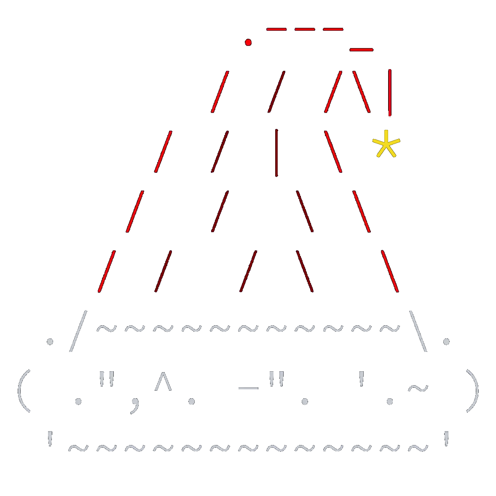

<b>**💡 All my [AoC](https://adventofcode.com) solutions 💡**</b>

<table>
    <thead>
    <tr>
      <th colspan="2"> &nbsp;&nbsp;&nbsp;<b>2024</b> <a href=https://adventofcode.com/2024/>⛓️‍💥</a></th>
       <th colspan="2"> &nbsp;&nbsp;&nbsp;<b>2025</b></th>
    </tr>
    </thead>
  <tbody>
    <tr>
      <td>
        <a href=https://github.com/Jorge-lopz/Advent-of-Code/tree/main/2024><b>Solutions</b></a>
      </td>
      <td>
        
      </td>
      <td>
        
      </td>
    </tr>
  </tbody>
  </table>

  
  

## 

### 📜 About

- **Daily Puzzles**: Solve programming challenges that test algorithms, problem-solving, and optimization skills.
- **Language**: My solutions are implemented in Python.
- **Focus**: Clean, efficient, and well-documented code for each challenge.

### 🎯 Goals

- [x] Solve all puzzles! **[25/25]**
- [x] Enhance problem-solving skills.
- [x] Celebrate the holiday spirit with the coding community! 🎅

##

<!-- AOC TILES BEGIN -->

<!-- AOC TILES END -->

